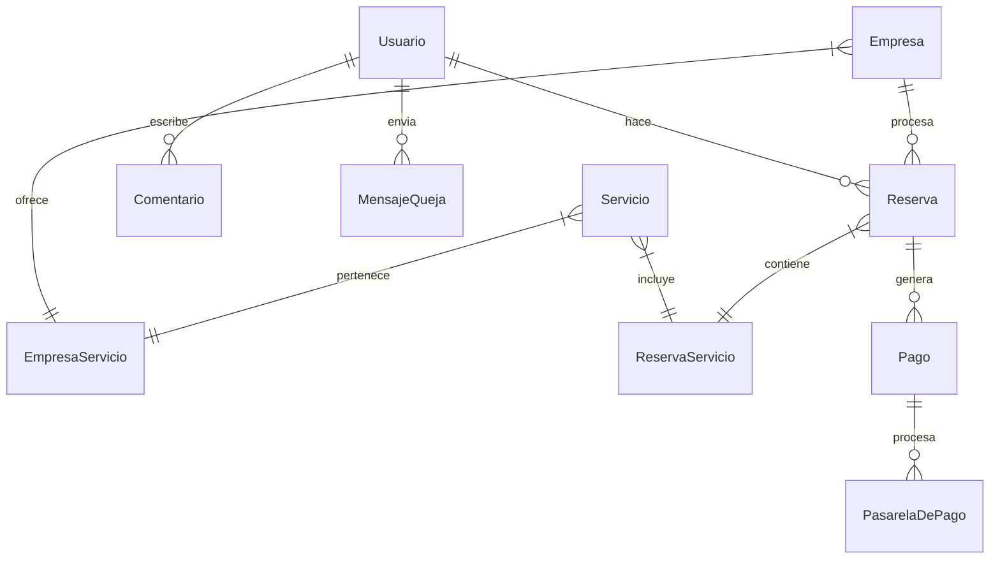

# 🔧 Documentación Técnica - AutoNew

## 📋 Índice

1. [Arquitectura del Sistema](#arquitectura-del-sistema)
2. [Modelos de Base de Datos](#modelos-de-base-de-datos)
3. [Vistas y Lógica de Negocio](#vistas-y-lógica-de-negocio)
4. [Sistema de Autenticación](#sistema-de-autenticación)
5. [APIs y Endpoints](#apis-y-endpoints)
6. [Frontend y Templates](#frontend-y-templates)
7. [Middleware Personalizado](#middleware-personalizado)
8. [Configuración](#configuración)
9. [Testing](#testing)
10. [Despliegue](#despliegue)

---

# 🏗️ Arquitectura del Sistema

## Patrón de Arquitectura: MVT (Model-View-Template)

```
┌─────────────────┐    ┌─────────────────┐    ┌─────────────────┐
│     MODELS      │    │      VIEWS      │    │    TEMPLATES    │
│                 │    │                 │    │                 │
│ - Usuario       │◄──►│ - home()        │◄──►│ - home.html     │
│ - Empresa       │    │ - reservas()    │    │ - reservas.html │
│ - Servicio      │    │ - login()       │    │ - login.html    │
│ - Reserva       │    │ - admin_views() │    │ - base.html     │
│ - Comentario    │    │                 │    │                 │
└─────────────────┘    └─────────────────┘    └─────────────────┘
         │                       │                       │
         └───────────────────────┼───────────────────────┘
                                 │
                    ┌─────────────────┐
                    │   URL ROUTING   │
                    │                 │
                    │ - autonew/urls  │
                    │ - app patterns  │
                    └─────────────────┘
```

## Componentes Principales

### 1. 🎯 Core Django
- **Versión**: Django 5.2.3
- **Base de Datos**: SQLite3 (desarrollo) / PostgreSQL (producción)
- **Autenticación**: Custom User Model
- **Admin**: Panel administrativo personalizado

### 2. 🎨 Frontend Stack
- **CSS Framework**: Tailwind CSS 4.0.1
- **Templates**: Django Templates
- **JavaScript**: Vanilla JS + AJAX
- **Images**: Pillow para manejo de archivos

### 3. 🔧 Desarrollo
- **Hot Reload**: django-browser-reload
- **Build Tool**: NPM + Tailwind CLI
- **Package Manager**: pip + npm

---

# 🗃️ Modelos de Base de Datos

## Diagrama ERD



## 📊 Detalles de Modelos

### 🧑‍💼 Usuario (CustomUser)
```python
class Usuario(AbstractBaseUser, PermissionsMixin):
    # Campos personalizados
    id_usuario = AutoField(primary_key=True)
    nombre_completo = CharField(max_length=255)
    nombre_usuario = CharField(max_length=20, unique=True)
    profile_picture = ImageField(upload_to='profile_pictures/')
    correo = EmailField(unique=True)
    telefono = CharField(max_length=15)
    direccion = CharField(max_length=255)
    token_reset = CharField(max_length=255, null=True)
    
    # Campos de autorización
    rol = CharField(choices=[('cliente', 'Cliente'), ('admin', 'Administrador')])
    is_active = BooleanField(default=True)
    is_staff = BooleanField(default=False)
    is_superuser = BooleanField(default=False)
    
    # Manager personalizado
    objects = UsuarioManager()
    
    USERNAME_FIELD = 'nombre_usuario'
    REQUIRED_FIELDS = ['correo']
```

**Características**:
- ✅ Hereda de `AbstractBaseUser` para autenticación personalizada
- 🔐 Contraseñas hasheadas automáticamente
- 📸 Soporte para foto de perfil
- 🎭 Sistema de roles integrado
- 📧 Validación de email único

### 🏢 Empresa
```python
class Empresa(models.Model):
    id_empresa = AutoField(primary_key=True)
    nombre_empresa = CharField(max_length=100)
    direccion = CharField(max_length=255)
    telefono = CharField(max_length=15)
    email = EmailField()
    servicios = ManyToManyField(Servicio, through='EmpresaServicio')
```

**Relaciones**:
- 📊 **Many-to-Many** con Servicios (a través de EmpresaServicio)
- 📅 **One-to-Many** con Reservas

### 🔧 Servicio
```python
class Servicio(models.Model):
    id_servicio = AutoField(primary_key=True)
    nombre_servicio = CharField(max_length=255, unique=True)
    descripcion = TextField()
    precio = FloatField()
```

**Validaciones**:
- ✅ Nombre único para evitar duplicados
- 💰 Precio como Float para flexibilidad
- 📝 Descripción detallada

### 📅 Reserva
```python
class Reserva(models.Model):
    id_reserva = AutoField(primary_key=True)
    fecha = DateField()
    hora = TimeField()
    estado = CharField(
        max_length=20, 
        choices=[('no_completado', 'No Completado'), ('completado', 'Completado')],
        default='no_completado'
    )
    empresa = ForeignKey(Empresa, on_delete=CASCADE)
    usuario = ForeignKey(Usuario, on_delete=CASCADE)
    servicios = ManyToManyField(Servicio, through='ReservaServicio')
```

**Estados**:
- 🟡 **no_completado**: Reserva pendiente
- 🟢 **completado**: Servicio realizado

### 💬 Comentario
```python
class Comentario(models.Model):
    id_comentario = AutoField(primary_key=True)
    comentario = TextField()
    fecha = DateTimeField(default=timezone.now)
    usuario = ForeignKey(Usuario, on_delete=CASCADE)
```

### 📝 MensajeQueja
```python
class MensajeQueja(models.Model):
    id_mensaje = AutoField(primary_key=True)
    contenido = TextField()
    fecha_envio = DateField(auto_now_add=True)
    estado = CharField(max_length=50, default='no respondido')
    respuesta = TextField(blank=True)
    usuario = ForeignKey(Usuario, on_delete=CASCADE)
```

---

# 🎯 Vistas y Lógica de Negocio

## 📁 Estructura de Vistas

### 🏠 Vistas Públicas
```python
def home(request):
    """Página principal con comentarios destacados"""
    comentarios = Comentario.objects.all().order_by('-fecha')
    return render(request, 'home.html', {'comentarios': comentarios})

def servicios(request):
    """Lista de servicios con comentarios"""
    comentarios = Comentario.objects.all().order_by('-fecha')
    return render(request, 'servicios.html', {'comentarios': comentarios})

def empresas(request):
    """Lista de empresas afiliadas"""
    return render(request, 'empresas.html')
```

### 🔐 Vistas de Autenticación
```python
def login(request):
    """Maneja login y registro de usuarios"""
    if request.user.is_authenticated:
        return redirect('home')
    
    if request.method == 'POST':
        # REGISTRO
        if 'nombre_completo' in request.POST:
            # Lógica de registro...
            nuevo_usuario = Usuario.objects.create_user(
                nombre_completo=nombre_completo,
                nombre_usuario=nombre_usuario,
                correo=correo,
                password=contrasena1
            )
            messages.success(request, "Usuario creado exitosamente")
            return redirect('login')
        
        # LOGIN
        else:
            usuario = authenticate(
                request, 
                username=nombre_usuario, 
                password=contrasena
            )
            if usuario:
                auth_login(request, usuario)
                return redirect('home')
    
    return render(request, 'login.html')
```

### 📅 Vista de Reservas (Compleja)
```python
def reservas(request):
    """Sistema completo de reservas"""
    ahora = timezone.now()
    hoy = ahora.date()
    
    # Datos para el formulario
    servicios = Servicio.objects.all()
    empresas = Empresa.objects.all()
    
    if request.method == 'POST':
        form = ReservaForm(request.POST)
        if form.is_valid():
            # Crear reserva
            reserva = form.save(commit=False)
            reserva.usuario = request.user
            reserva.save()
            
            # Asociar servicios
            servicios_ids = request.POST.getlist('servicios')
            for servicio_id in servicios_ids:
                ReservaServicio.objects.create(
                    reserva=reserva,
                    servicio_id=servicio_id
                )
            
            messages.success(request, "Reserva creada exitosamente")
            return redirect('reservas')
    
    # Filtrar horas ocupadas
    fecha_seleccionada = request.GET.get('fecha')
    if fecha_seleccionada:
        reservas_dia = Reserva.objects.filter(fecha=fecha_seleccionada)
        horas_ocupadas = [r.hora.strftime('%H:%M') for r in reservas_dia]
    else:
        horas_ocupadas = []
    
    context = {
        'servicios': servicios,
        'empresas': empresas,
        'horas_ocupadas': horas_ocupadas,
        'fecha_minima': hoy.isoformat()
    }
    
    return render(request, 'reservas.html', context)
```

### 🛡️ Vistas Administrativas con Decorador
```python
@admin_required
def usuarios_crud(request):
    """CRUD completo de usuarios - solo admins"""
    if request.method == 'POST':
        form = UsuariosForm(request.POST)
        if form.is_valid():
            form.save()
            messages.success(request, "Usuario creado exitosamente")
    
    usuarios = Usuario.objects.all().order_by('-id_usuario')
    form = UsuariosForm()
    
    return render(request, 'usuarios_crud.html', {
        'usuarios': usuarios,
        'form': form
    })

@admin_required
def cambiar_estado_reserva(request, reserva_id):
    """Cambiar estado de una reserva específica"""
    reserva = get_object_or_404(Reserva, id_reserva=reserva_id)
    
    # Toggle estado
    if reserva.estado == 'no_completado':
        reserva.estado = 'completado'
        mensaje = 'marcada como completada'
    else:
        reserva.estado = 'no_completado'
        mensaje = 'marcada como no completada'
    
    reserva.save()
    messages.success(request, f'Reserva #{reserva_id} {mensaje}')
    return redirect('citascrud')
```

## 🔄 APIs AJAX

### 📊 Endpoints para Datos Dinámicos
```python
def obtener_servicios(request):
    """API para obtener servicios de una empresa"""
    empresa_id = request.GET.get('empresa_id')
    if empresa_id:
        servicios = Servicio.objects.filter(
            empresaservicio__empresa_id=empresa_id
        ).values('id_servicio', 'nombre_servicio', 'precio')
        return JsonResponse(list(servicios), safe=False)
    return JsonResponse([], safe=False)

def get_horas(request):
    """API para obtener horas disponibles"""
    fecha = request.GET.get('fecha')
    if fecha:
        reservas = Reserva.objects.filter(fecha=fecha)
        horas_ocupadas = [r.hora.strftime('%H:%M') for r in reservas]
        return JsonResponse({'horas_ocupadas': horas_ocupadas})
    return JsonResponse({'horas_ocupadas': []})
```

---

# 🔐 Sistema de Autenticación

## Manager Personalizado
```python
class UsuarioManager(BaseUserManager):
    def create_user(self, nombre_usuario, correo, password=None, **extra_fields):
        """Crear usuario normal"""
        if not correo:
            raise ValueError('El usuario debe tener un correo electrónico')
        if not nombre_usuario:
            raise ValueError('El usuario debe tener un nombre de usuario')
        
        correo = self.normalize_email(correo)
        user = self.model(
            nombre_usuario=nombre_usuario, 
            correo=correo, 
            **extra_fields
        )
        user.set_password(password)  # Hash automático
        user.save(using=self._db)
        return user
    
    def create_superuser(self, nombre_usuario, correo, password=None, **extra_fields):
        """Crear superusuario"""
        extra_fields.setdefault('is_staff', True)
        extra_fields.setdefault('is_superuser', True)
        extra_fields.setdefault('rol', 'admin')
        
        return self.create_user(nombre_usuario, correo, password, **extra_fields)
```

## Decorador de Seguridad
```python
def admin_required(function):
    """Decorador para verificar rol de administrador"""
    @wraps(function)
    def wrap(request, *args, **kwargs):
        # Verificar autenticación
        if not request.user.is_authenticated:
            messages.error(request, 'Debes iniciar sesión como administrador')
            return redirect('logincrud')
        
        # Verificar rol
        if not hasattr(request.user, 'rol') or request.user.rol != 'admin':
            messages.error(request, 'Acceso denegado. Solo administradores.')
            return redirect('logincrud')
        
        return function(request, *args, **kwargs)
    return wrap
```

## Configuración en Settings
```python
# Usuario personalizado
AUTH_USER_MODEL = 'lavado_auto.Usuario'

# URLs de redirección
LOGIN_URL = 'logincrud'
LOGIN_REDIRECT_URL = 'homecrud'
LOGOUT_REDIRECT_URL = 'home'

# Validadores de contraseña
AUTH_PASSWORD_VALIDATORS = [
    {
        'NAME': 'django.contrib.auth.password_validation.UserAttributeSimilarityValidator',
    },
    {
        'NAME': 'django.contrib.auth.password_validation.MinimumLengthValidator',
    },
    {
        'NAME': 'django.contrib.auth.password_validation.CommonPasswordValidator',
    },
    {
        'NAME': 'django.contrib.auth.password_validation.NumericPasswordValidator',
    },
]
```

---

# 🌐 APIs y Endpoints

## 📋 Mapa de URLs

### URLs Públicas
```python
urlpatterns = [
    # Páginas principales
    path('', views.home, name='home'),
    path('nosotros/', views.nosotros, name='nosotros'),
    path('servicios/', views.servicios, name='servicios'),
    path('empresas/', views.empresas, name='empresas'),
    path('reservas/', views.reservas, name='reservas'),
    
    # Autenticación
    path('login/', views.login, name='login'),
    path('logout/', views.logout, name='logout'),
    path('perfil/', views.perfil_usuario, name='perfil'),
    
    # Interacciones
    path('comentarios/', views.comentarios, name='comentarios'),
    path('contacto/', views.contacto, name='contacto'),
    
    # APIs AJAX
    path('obtener-servicios/', views.obtener_servicios, name='obtener_servicios'),
    path('obtener-info-empresa/', views.obtener_info_empresa, name='obtener_info_empresa'),
    path('get-horas/', views.get_horas, name='get_horas'),
]
```

### URLs Administrativas
```python
# CRUD Admin (requieren @admin_required)
admin_patterns = [
    path('logincrud/', views.login_crud, name='logincrud'),
    path('homecrud/', views.home_crud, name='homecrud'),
    path('usuarioscrud/', views.usuarios_crud, name='usuarioscrud'),
    path('empresascrud/', views.empresas_crud, name='empresascrud'),
    path('servicioscrud/', views.servicios_crud, name='servicioscrud'),
    path('citascrud/', views.citas_crud, name='citascrud'),
    path('comentarioscrud/', views.comentarios_crud, name='comentarioscrud'),
    path('quejascrud/', views.quejas_crud, name='quejascrud'),
    
    # Acciones específicas
    path('citascrud/cambiar_estado/<int:reserva_id>/', 
         views.cambiar_estado_reserva, 
         name='cambiar_estado_reserva'),
]
```

## 📡 APIs AJAX Detalladas

### 1. Obtener Servicios por Empresa
```javascript
// Frontend
function cargarServicios(empresaId) {
    fetch(`/obtener-servicios/?empresa_id=${empresaId}`)
        .then(response => response.json())
        .then(servicios => {
            const container = document.getElementById('servicios-container');
            container.innerHTML = '';
            
            servicios.forEach(servicio => {
                const checkbox = `
                    <label class="flex items-center space-x-2">
                        <input type="checkbox" 
                               name="servicios" 
                               value="${servicio.id_servicio}"
                               onchange="calcularTotal()">
                        <span>${servicio.nombre_servicio} - $${servicio.precio}</span>
                    </label>
                `;
                container.innerHTML += checkbox;
            });
        });
}
```

```python
# Backend
def obtener_servicios(request):
    empresa_id = request.GET.get('empresa_id')
    if empresa_id:
        try:
            servicios = Servicio.objects.filter(
                empresaservicio__empresa_id=empresa_id
            ).values('id_servicio', 'nombre_servicio', 'precio', 'descripcion')
            return JsonResponse(list(servicios), safe=False)
        except Exception as e:
            return JsonResponse({'error': str(e)}, status=500)
    return JsonResponse([], safe=False)
```

### 2. Verificar Horas Disponibles
```javascript
// Frontend
function verificarHorasDisponibles(fecha) {
    fetch(`/get-horas/?fecha=${fecha}`)
        .then(response => response.json())
        .then(data => {
            const horasOcupadas = data.horas_ocupadas;
            const selectHora = document.getElementById('hora');
            
            Array.from(selectHora.options).forEach(option => {
                option.disabled = horasOcupadas.includes(option.value);
            });
        });
}
```

## 🔒 Seguridad en APIs

### CSRF Protection
```python
from django.views.decorators.csrf import csrf_exempt
from django.middleware.csrf import get_token

# En vistas AJAX que requieren POST
def api_endpoint(request):
    if request.method == 'POST':
        # Django verifica CSRF automáticamente
        pass
```

### Validación de Permisos
```python
from django.contrib.auth.decorators import login_required
from django.http import JsonResponse

@login_required
def api_privada(request):
    if not request.user.rol == 'admin':
        return JsonResponse({'error': 'Permisos insuficientes'}, status=403)
    
    # Lógica de la API...
```

---

# 🎨 Frontend y Templates

## 📁 Estructura de Templates

```
templates/
├── base.html              # Template principal
├── base_crud.html         # Template para admin
├── 
├── # Páginas públicas
├── home.html
├── login.html
├── servicios.html
├── empresas.html
├── reservas.html
├── contacto.html
├── perfil_usuario.html
├── 
├── # Páginas administrativas
├── home_crud.html
├── login_crud.html
├── usuarios_crud.html
├── empresas_crud.html
├── servicios_crud.html
├── citas_crud.html
├── comentarios_crud.html
└── quejas_crud.html
```

## 🎯 Template Base

```html
<!-- base.html -->
<!DOCTYPE html>
<html lang="es">
<head>
    <meta charset="UTF-8">
    <meta name="viewport" content="width=device-width, initial-scale=1.0">
    <title>AutoNew</title>
    
    <!-- Tailwind CSS -->
    
    <link rel="stylesheet" href="">
    
    <!-- Favicon -->
    <link rel="icon" type="image/png" href="">
    
    
</head>

<body class="bg-gray-50">
    <!-- Navigation -->
    <nav class="bg-white shadow-lg">
        <div class="max-w-7xl mx-auto px-4">
            <div class="flex justify-between items-center py-4">
                <!-- Logo -->
                <div class="flex items-center">
                    
                    <span class="ml-2 text-xl font-bold text-gray-800">AutoNew</span>
                </div>
                
                <!-- Menu -->
                <div class="hidden md:flex space-x-8">
                    <a href="" class="text-gray-600 hover:text-blue-600">Inicio</a>
                    <a href="" class="text-gray-600 hover:text-blue-600">Servicios</a>
                    <a href="" class="text-gray-600 hover:text-blue-600">Empresas</a>
                    <a href="" class="text-gray-600 hover:text-blue-600">Reservas</a>
                    <a href="" class="text-gray-600 hover:text-blue-600">Contacto</a>
                </div>
                
                <!-- User Menu -->
                <div class="flex items-center space-x-4">
                    
                        <div class="flex items-center space-x-2">
                            
                                
                            
                            <span class="text-gray-700">{{ user.nombre_completo }}</span>
                        </div>
                        <a href="" class="btn-secondary">Perfil</a>
                        <a href="" class="btn-primary">Cerrar Sesión</a>
                        
                        
                            <a href="" class="btn-admin">Admin</a>
                        
                    
                        <a href="" class="btn-primary">Iniciar Sesión</a>
                    
                </div>
            </div>
        </div>
    </nav>

    <!-- Messages -->
    
        <div class="max-w-7xl mx-auto px-4 py-4">
            
                <div class="alert alert-{{ message.tags }} mb-4">
                    {{ message }}
                </div>
            
        </div>
    

    <!-- Main Content -->
    <main class="max-w-7xl mx-auto px-4 py-8">
        
        
    </main>

    <!-- Footer -->
    <footer class="bg-gray-800 text-white py-8 mt-16">
        <div class="max-w-7xl mx-auto px-4">
            <div class="grid grid-cols-1 md:grid-cols-3 gap-8">
                <div>
                    <h3 class="text-lg font-semibold mb-4">AutoNew</h3>
                    <p class="text-gray-300">Tu mejor opción para el cuidado de tu vehículo.</p>
                </div>
                <div>
                    <h4 class="text-lg font-semibold mb-4">Enlaces</h4>
                    <ul class="space-y-2 text-gray-300">
                        <li><a href="">Nosotros</a></li>
                        <li><a href="">Servicios</a></li>
                        <li><a href="">Contacto</a></li>
                    </ul>
                </div>
                <div>
                    <h4 class="text-lg font-semibold mb-4">Contacto</h4>
                    <p class="text-gray-300">Email: info@autonew.com</p>
                    <p class="text-gray-300">Teléfono: +57 300 123 4567</p>
                </div>
            </div>
        </div>
    </footer>

    <!-- JavaScript -->
    
</body>
</html>
```

## 🎨 Clases CSS Personalizadas

```css
/* En input.css de Tailwind */
@tailwind base;
@tailwind components;
@tailwind utilities;

/* Componentes personalizados */
@layer components {
    .btn-primary {
        @apply bg-blue-600 hover:bg-blue-700 text-white font-bold py-2 px-4 rounded transition duration-200;
    }
    
    .btn-secondary {
        @apply bg-gray-600 hover:bg-gray-700 text-white font-bold py-2 px-4 rounded transition duration-200;
    }
    
    .btn-admin {
        @apply bg-red-600 hover:bg-red-700 text-white font-bold py-2 px-4 rounded transition duration-200;
    }
    
    .alert {
        @apply p-4 rounded-md border-l-4;
    }
    
    .alert-success {
        @apply bg-green-50 border-green-400 text-green-700;
    }
    
    .alert-error {
        @apply bg-red-50 border-red-400 text-red-700;
    }
    
    .alert-warning {
        @apply bg-yellow-50 border-yellow-400 text-yellow-700;
    }
    
    .form-input {
        @apply block w-full px-3 py-2 border border-gray-300 rounded-md shadow-sm focus:outline-none focus:ring-blue-500 focus:border-blue-500;
    }
    
    .card {
        @apply bg-white rounded-lg shadow-md p-6;
    }
}
```

## ⚡ JavaScript Interactivo

```javascript
// Funciones globales para todas las páginas

// Cálculo de total en reservas
function calcularTotal() {
    const serviciosSeleccionados = document.querySelectorAll('input[name="servicios"]:checked');
    let total = 0;
    
    serviciosSeleccionados.forEach(servicio => {
        const precio = parseFloat(servicio.dataset.precio);
        total += precio;
    });
    
    document.getElementById('total-precio').textContent = `$${total.toLocaleString()}`;
}

// Confirmación de eliminación
function confirmarEliminacion(elemento, nombre) {
    return confirm(`¿Estás seguro de que deseas eliminar ${elemento}: "${nombre}"?\n\nEsta acción no se puede deshacer.`);
}

// Preview de imagen de perfil
function previewImage(input) {
    if (input.files && input.files[0]) {
        const reader = new FileReader();
        reader.onload = function(e) {
            document.getElementById('profile-preview').src = e.target.result;
        };
        reader.readAsDataURL(input.files[0]);
    }
}

// Filtros dinámicos en tablas admin
function filtrarTabla(inputId, tablaId) {
    const input = document.getElementById(inputId);
    const tabla = document.getElementById(tablaId);
    const filas = tabla.getElementsByTagName('tr');
    
    input.addEventListener('keyup', function() {
        const filtro = this.value.toLowerCase();
        
        for (let i = 1; i < filas.length; i++) { // Empezar en 1 para saltear header
            const fila = filas[i];
            const textoFila = fila.textContent || fila.innerText;
            
            if (textoFila.toLowerCase().indexOf(filtro) > -1) {
                fila.style.display = '';
            } else {
                fila.style.display = 'none';
            }
        }
    });
}
```

---

# 🛡️ Middleware Personalizado

## AdminCRUDMiddleware

```python
# lavado_auto/middleware.py
class AdminCRUDMiddleware:
    """
    Middleware para proteger automáticamente todas las rutas CRUD
    que requieren permisos de administrador.
    """
    
    def __init__(self, get_response):
        self.get_response = get_response
        
        # URLs que requieren rol admin
        self.admin_required_urls = [
            '/homecrud/',
            '/usuarioscrud/',
            '/empresascrud/',
            '/servicioscrud/',
            '/citascrud/',
            '/comentarioscrud/',
            '/quejascrud/',
        ]
    
    def __call__(self, request):
        # Verificar si la URL requiere permisos admin
        if any(request.path.startswith(url) for url in self.admin_required_urls):
            
            # Verificar autenticación
            if not request.user.is_authenticated:
                messages.error(request, 'Debes iniciar sesión como administrador.')
                return redirect('logincrud')
            
            # Verificar rol admin
            if not hasattr(request.user, 'rol') or request.user.rol != 'admin':
                messages.error(request, 'Acceso denegado. Solo administradores.')
                return redirect('logincrud')
        
        response = self.get_response(request)
        return response
```

## Configuración en Settings

```python
# autonew/settings.py
MIDDLEWARE = [
    'django.middleware.security.SecurityMiddleware',
    'django.contrib.sessions.middleware.SessionMiddleware',
    'django.middleware.common.CommonMiddleware',
    'django.middleware.csrf.CsrfViewMiddleware',
    'django.contrib.auth.middleware.AuthenticationMiddleware',
    'django.contrib.messages.middleware.MessageMiddleware',
    
    # Middleware personalizado
    'lavado_auto.middleware.AdminCRUDMiddleware',
    
    'django.middleware.clickjacking.XFrameOptionsMiddleware',
    'django_browser_reload.middleware.BrowserReloadMiddleware',
]
```

---

# ⚙️ Configuración

## Settings Principal

```python
# autonew/settings.py
import os
from pathlib import Path

BASE_DIR = Path(__file__).resolve().parent.parent

# SECURITY WARNING: keep the secret key used in production secret!
SECRET_KEY = 'django-insecure-&!fr6jltkve_c*kad+))rbb#j++d@_jp-_8-+fsnos+!_!0_m7'

# SECURITY WARNING: don't run with debug turned on in production!
DEBUG = True
ALLOWED_HOSTS = []

# Application definition
INSTALLED_APPS = [
    'django.contrib.admin',
    'django.contrib.auth',
    'django.contrib.contenttypes',
    'django.contrib.sessions',
    'django.contrib.messages',
    'django.contrib.staticfiles',
    
    # Apps propias
    'lavado_auto',
    
    # Third party apps
    'tailwind',
    'theme',
    'django_browser_reload',
]

# Tailwind CSS
TAILWIND_APP_NAME = 'theme'
INTERNAL_IPS = ['127.0.0.1']

# Custom User Model
AUTH_USER_MODEL = 'lavado_auto.Usuario'

# Login URLs
LOGIN_URL = 'logincrud'
LOGIN_REDIRECT_URL = 'homecrud'
LOGOUT_REDIRECT_URL = 'home'

# Database
DATABASES = {
    'default': {
        'ENGINE': 'django.db.backends.sqlite3',
        'NAME': BASE_DIR / 'db.sqlite3',
    }
}

# Internationalization
LANGUAGE_CODE = 'es-co'
TIME_ZONE = 'America/Bogota'
USE_I18N = True
USE_TZ = True

# Static files
STATIC_URL = 'static/'
STATICFILES_DIRS = [
    BASE_DIR / "theme" / "static",
]

# Media files
MEDIA_URL = '/media/'
MEDIA_ROOT = os.path.join(BASE_DIR, 'media/')

# Default primary key field type
DEFAULT_AUTO_FIELD = 'django.db.models.BigAutoField'
```

## Configuración de Tailwind

```javascript
// theme/tailwind.config.js
module.exports = {
  content: [
    '../**/templates/**/*.html',
    '../**/static/**/*.js',
  ],
  theme: {
    extend: {
      colors: {
        'primary': '#3B82F6',
        'secondary': '#6B7280',
        'accent': '#F59E0B',
        'success': '#10B981',
        'warning': '#F59E0B',
        'error': '#EF4444',
      },
      fontFamily: {
        'sans': ['Inter', 'system-ui', 'sans-serif'],
      },
    },
  },
  plugins: [],
}
```

```json
// theme/package.json
{
  "name": "theme",
  "version": "1.0.0",
  "description": "",
  "main": "index.js",
  "scripts": {
    "build": "tailwindcss -i ./static_src/src/input.css -o ./static/css/dist/styles.css --minify",
    "build-dev": "tailwindcss -i ./static_src/src/input.css -o ./static/css/dist/styles.css --watch"
  },
  "keywords": [],
  "author": "",
  "license": "ISC",
  "devDependencies": {
    "tailwindcss": "^3.4.0"
  }
}
```

---

# 🧪 Testing

## Estructura de Tests

```python
# lavado_auto/tests.py
from django.test import TestCase, Client
from django.contrib.auth import get_user_model
from django.urls import reverse
from .models import Usuario, Empresa, Servicio, Reserva

Usuario = get_user_model()

class UsuarioModelTest(TestCase):
    """Tests para el modelo Usuario"""
    
    def setUp(self):
        self.usuario = Usuario.objects.create_user(
            nombre_usuario='testuser',
            correo='test@test.com',
            password='testpass123',
            nombre_completo='Usuario Test'
        )
    
    def test_usuario_creation(self):
        """Test creación de usuario"""
        self.assertEqual(self.usuario.nombre_usuario, 'testuser')
        self.assertEqual(self.usuario.correo, 'test@test.com')
        self.assertTrue(self.usuario.check_password('testpass123'))
        self.assertEqual(self.usuario.rol, 'cliente')
    
    def test_usuario_str(self):
        """Test representación string del usuario"""
        self.assertEqual(str(self.usuario), 'testuser')
    
    def test_create_superuser(self):
        """Test creación de superusuario"""
        admin = Usuario.objects.create_superuser(
            nombre_usuario='admin',
            correo='admin@test.com',
            password='adminpass123'
        )
        self.assertTrue(admin.is_superuser)
        self.assertTrue(admin.is_staff)
        self.assertEqual(admin.rol, 'admin')

class ViewsTest(TestCase):
    """Tests para las vistas"""
    
    def setUp(self):
        self.client = Client()
        self.usuario = Usuario.objects.create_user(
            nombre_usuario='testuser',
            correo='test@test.com',
            password='testpass123',
            nombre_completo='Usuario Test'
        )
        self.admin = Usuario.objects.create_user(
            nombre_usuario='admin',
            correo='admin@test.com',
            password='adminpass123',
            nombre_completo='Admin Test',
            rol='admin'
        )
    
    def test_home_view(self):
        """Test vista home"""
        response = self.client.get(reverse('home'))
        self.assertEqual(response.status_code, 200)
        self.assertContains(response, 'AutoNew')
    
    def test_login_view_get(self):
        """Test vista login GET"""
        response = self.client.get(reverse('login'))
        self.assertEqual(response.status_code, 200)
        self.assertContains(response, 'Iniciar Sesión')
    
    def test_login_view_post_valid(self):
        """Test login con credenciales válidas"""
        response = self.client.post(reverse('login'), {
            'nombre_usuario': 'testuser',
            'contrasena': 'testpass123'
        })
        self.assertEqual(response.status_code, 302)  # Redirección
    
    def test_login_view_post_invalid(self):
        """Test login con credenciales inválidas"""
        response = self.client.post(reverse('login'), {
            'nombre_usuario': 'testuser',
            'contrasena': 'wrongpass'
        })
        self.assertEqual(response.status_code, 302)
        # Verificar mensaje de error
    
    def test_admin_required_decorator(self):
        """Test decorador admin_required"""
        # Usuario no autenticado
        response = self.client.get(reverse('homecrud'))
        self.assertEqual(response.status_code, 302)
        
        # Usuario cliente
        self.client.login(username='testuser', password='testpass123')
        response = self.client.get(reverse('homecrud'))
        self.assertEqual(response.status_code, 302)
        
        # Usuario admin
        self.client.login(username='admin', password='adminpass123')
        response = self.client.get(reverse('homecrud'))
        self.assertEqual(response.status_code, 200)

class ReservaTest(TestCase):
    """Tests para el sistema de reservas"""
    
    def setUp(self):
        self.usuario = Usuario.objects.create_user(
            nombre_usuario='testuser',
            correo='test@test.com',
            password='testpass123'
        )
        self.empresa = Empresa.objects.create(
            nombre_empresa='Test Empresa',
            direccion='Test Address',
            telefono='1234567890',
            email='empresa@test.com'
        )
        self.servicio = Servicio.objects.create(
            nombre_servicio='Test Servicio',
            descripcion='Descripción test',
            precio=50000
        )
    
    def test_crear_reserva(self):
        """Test creación de reserva"""
        reserva = Reserva.objects.create(
            fecha='2025-07-01',
            hora='10:00',
            empresa=self.empresa,
            usuario=self.usuario
        )
        self.assertEqual(reserva.estado, 'no_completado')
        self.assertEqual(str(reserva), f'Reserva {reserva.id_reserva} - testuser')

class APITest(TestCase):
    """Tests para las APIs AJAX"""
    
    def setUp(self):
        self.empresa = Empresa.objects.create(
            nombre_empresa='Test Empresa',
            direccion='Test Address',
            telefono='1234567890',
            email='empresa@test.com'
        )
        self.servicio = Servicio.objects.create(
            nombre_servicio='Test Servicio',
            descripcion='Descripción test',
            precio=50000
        )
    
    def test_obtener_servicios_api(self):
        """Test API obtener servicios"""
        # Asociar servicio a empresa
        from .models import EmpresaServicio
        EmpresaServicio.objects.create(
            empresa=self.empresa,
            servicio=self.servicio
        )
        
        response = self.client.get(f'/obtener-servicios/?empresa_id={self.empresa.id_empresa}')
        self.assertEqual(response.status_code, 200)
        
        data = response.json()
        self.assertEqual(len(data), 1)
        self.assertEqual(data[0]['nombre_servicio'], 'Test Servicio')
```

## Comandos de Testing

```bash
# Ejecutar todos los tests
python manage.py test

# Tests específicos
python manage.py test lavado_auto.tests.UsuarioModelTest

# Tests con coverage
pip install coverage
coverage run --source='.' manage.py test
coverage report -m
coverage html
```

---

# 🚀 Despliegue

## Preparación para Producción

### 1. Settings de Producción
```python
# autonew/settings_production.py
from .settings import *
import os

DEBUG = False
ALLOWED_HOSTS = ['tu-dominio.com', 'www.tu-dominio.com']

# Base de datos PostgreSQL
DATABASES = {
    'default': {
        'ENGINE': 'django.db.backends.postgresql',
        'NAME': os.environ.get('DB_NAME'),
        'USER': os.environ.get('DB_USER'),
        'PASSWORD': os.environ.get('DB_PASSWORD'),
        'HOST': os.environ.get('DB_HOST', 'localhost'),
        'PORT': os.environ.get('DB_PORT', '5432'),
    }
}

# Seguridad
SECRET_KEY = os.environ.get('SECRET_KEY')
SECURE_SSL_REDIRECT = True
SESSION_COOKIE_SECURE = True
CSRF_COOKIE_SECURE = True

# Archivos estáticos
STATIC_ROOT = '/var/www/autonew/static/'
MEDIA_ROOT = '/var/www/autonew/media/'

# Email
EMAIL_BACKEND = 'django.core.mail.backends.smtp.EmailBackend'
EMAIL_HOST = 'smtp.gmail.com'
EMAIL_PORT = 587
EMAIL_USE_TLS = True
EMAIL_HOST_USER = os.environ.get('EMAIL_USER')
EMAIL_HOST_PASSWORD = os.environ.get('EMAIL_PASSWORD')
```

### 2. Requirements de Producción
```txt
# requirements_production.txt
Django==5.2.3
psycopg2-binary==2.9.7
gunicorn==21.2.0
pillow==11.2.1
whitenoise==6.5.0
django-cors-headers==4.3.1
```

### 3. Docker Configuration
```dockerfile
# Dockerfile
FROM python:3.12-slim

WORKDIR /app

# Instalar dependencias del sistema
RUN apt-get update && apt-get install -y \
    postgresql-client \
    build-essential \
    && rm -rf /var/lib/apt/lists/*

# Copiar requirements e instalar
COPY requirements_production.txt .
RUN pip install --no-cache-dir -r requirements_production.txt

# Copiar código
COPY . .

# Instalar dependencias de Node.js para Tailwind
RUN curl -fsSL https://deb.nodesource.com/setup_18.x | bash - \
    && apt-get install -y nodejs

# Build CSS
WORKDIR /app/theme
RUN npm install && npm run build

WORKDIR /app

# Collectstatic
RUN python manage.py collectstatic --noinput --settings=autonew.settings_production

EXPOSE 8000

CMD ["gunicorn", "--bind", "0.0.0.0:8000", "autonew.wsgi:application"]
```

```yaml
# docker-compose.yml
version: '3.8'

services:
  db:
    image: postgres:15
    environment:
      POSTGRES_DB: autonew_db
      POSTGRES_USER: autonew_user
      POSTGRES_PASSWORD: ${DB_PASSWORD}
    volumes:
      - postgres_data:/var/lib/postgresql/data

  web:
    build: .
    ports:
      - "8000:8000"
    environment:
      - DB_NAME=autonew_db
      - DB_USER=autonew_user
      - DB_PASSWORD=${DB_PASSWORD}
      - DB_HOST=db
      - SECRET_KEY=${SECRET_KEY}
    depends_on:
      - db
    volumes:
      - static_volume:/app/static
      - media_volume:/app/media

  nginx:
    image: nginx:alpine
    ports:
      - "80:80"
      - "443:443"
    volumes:
      - ./nginx.conf:/etc/nginx/nginx.conf
      - static_volume:/var/www/static
      - media_volume:/var/www/media
    depends_on:
      - web

volumes:
  postgres_data:
  static_volume:
  media_volume:
```

### 4. Nginx Configuration
```nginx
# nginx.conf
upstream django {
    server web:8000;
}

server {
    listen 80;
    server_name tu-dominio.com www.tu-dominio.com;
    
    location / {
        proxy_pass http://django;
        proxy_set_header X-Forwarded-For $proxy_add_x_forwarded_for;
        proxy_set_header Host $host;
        proxy_redirect off;
    }
    
    location /static/ {
        alias /var/www/static/;
    }
    
    location /media/ {
        alias /var/www/media/;
    }
}
```

## Comandos de Despliegue

```bash
# Build y desplegar con Docker
docker-compose up --build -d

# Migraciones en producción
docker-compose exec web python manage.py migrate --settings=autonew.settings_production

# Crear superusuario
docker-compose exec web python manage.py createsuperuser --settings=autonew.settings_production

# Recopilar archivos estáticos
docker-compose exec web python manage.py collectstatic --noinput --settings=autonew.settings_production
```

---

# 📚 Recursos Adicionales

## 📖 Documentación de Django
- [Django Official Docs](https://docs.djangoproject.com/)
- [Django Best Practices](https://django-best-practices.readthedocs.io/)

## 🎨 Tailwind CSS
- [Tailwind CSS Documentation](https://tailwindcss.com/docs)
- [Tailwind Components](https://tailwindui.com/)

## 🛡️ Seguridad
- [Django Security](https://docs.djangoproject.com/en/stable/topics/security/)
- [OWASP Top 10](https://owasp.org/www-project-top-ten/)

## 📊 Performance
- [Django Performance Tips](https://docs.djangoproject.com/en/stable/topics/performance/)
- [Database Optimization](https://docs.djangoproject.com/en/stable/topics/db/optimization/)

---

*Documentación técnica generada para AutoNew v1.0*  
*Última actualización: Junio 2025*
